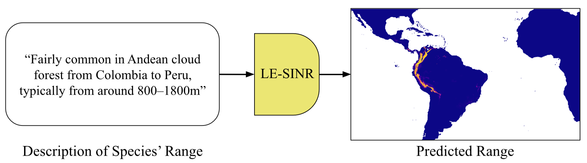

#  	Combining Observational Data and Language for Species Range Estimation - NeurIPS 2024

Code for training and evaluating global-scale species range estimation models. This code enables the recreation of the results from our Neurips paper [Combining Observational Data and Language for Species Range Estimation](https://arxiv.org/abs/2410.10931). 

## 🌍 Overview 
Species range maps (SRMs) are essential tools for research and policy-making in ecology, conservation, and environmental management. However, traditional SRMs rely on the availability of environmental covariates and high-quality species location observation data, both of which can be challenging to obtain due to geographic inaccessibility and resource constraints. We propose a novel approach combining millions of citizen science species observations with textual descriptions from Wikipedia, covering habitat preferences and range descriptions for tens of thousands of species. Our framework maps locations, species, and text descriptions into a common space, facilitating the learning of rich spatial covariates at a global scale and enabling zero-shot range estimation from textual descriptions. Evaluated on held-out species, our zero-shot SRMs significantly outperform baselines and match the performance of SRMs obtained using tens of observations. Our approach also acts as a strong prior when combined with observational data, resulting in more accurate range estimation with less data.

<sup>Our LE-SINR model takes as input free-form text describing aspects of a species’ preferred
habitat or range and geospatially grounds it to generate a plausible range map for that species.<sup>

## 🔍 Getting Started 

#### Installing Required Packages

1. We recommend using an isolated Python environment to avoid dependency issues. Install the Anaconda Python 3.9 distribution for your operating system from [here](https://www.anaconda.com/download). 

2. Create a new environment and activate it:
```bash
 conda create -y --name sinr_icml python==3.9
 conda activate sinr_icml
```

3. After activating the environment, install the required packages:
```bash
 pip3 install -r requirements.txt
```

### Downloading Pre-trained Models
We provide the weights for two different model configurations. Our best performing model is available [here](https://drive.google.com/file/d/1Q5E2wlplynunKx3OdmooXFLiu2dl8nkI/view), which takes environmental covariates as input. Our position-only model is available [here](https://drive.google.com/file/d/1Gkjd--w1LgI64Gpk5w6d_NaivmyzYq35/view?usp=drive_link). These models go in the `pretrained_models` folder.

#### Data Download and Preparation
To train or evaluate a model yourself, you will need to download the text and observation data. Instructions for downloading the data in `data/README.md`. To run inference with the best model, you only need to download Environmental Features.

## 🗺️ Generating Predictions
To visualize range predictions from a text input, run the following command: 
```bash
 python viz_text_feats.py
```
The script will prompt you to provide text and then generates a range map.

Note, before you run this command you may need to first download the data as described in `data/README.md`. In addition, if you want to evaluate some of the pretrained models from the paper, you need to download those first and place them at `pretrained_models`.

## 🚅 Training and Evaluating Models

To train and evaluate a model, run the following command:
```bash
 python train_and_evaluate_models.py
```

#### Hyperparameters
Common parameters of interest can be set within `train_and_evaluate_models.py`. All other parameters are exposed in `setup.py`. 

#### Outputs
By default, trained models and evaluation results will be saved to a folder in the `experiments` directory. Evaluation results will also be printed to the command line. 

##  🙏 Acknowledgements
This project was funded by a Royal Society Research Grant and supported by grant #2329927 from the National Science Foundation. This codebase is built off of [SINR](https://github.com/elijahcole/sinr/tree/main).

If you find our work useful in your research please consider citing our paper.
```
@inproceedings{
    hamilton2024combining,
    title={Combining Observational Data and Language for Species Range Estimation},
    author={Max Hamilton and Christian Lange and Elijah Cole and Alexander Shepard and Samuel Heinrich and Oisin Mac Aodha and Grant Van Horn and Subhransu Maji},
    booktitle={The Thirty-eighth Annual Conference on Neural Information Processing Systems},
    year={2024},
    url={https://openreview.net/forum?id=IOKLUxB05h}
}
```

## 📜 Disclaimer
Our models rely on text embeddings and summaries generated from LLMs, and thus may inherit the biases contained within them. Both Wikipedia text and
observational data from iNaturalist are biased toward the United States and Western Europe. As a result, there could be potential negative consequences associated with using the species range predictions from our model to inform conservation or policy decisions. Therefore, caution is encouraged when  making decisions based on the model’s predictions.
